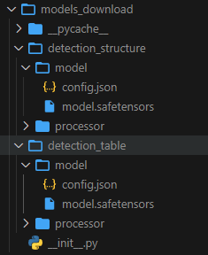
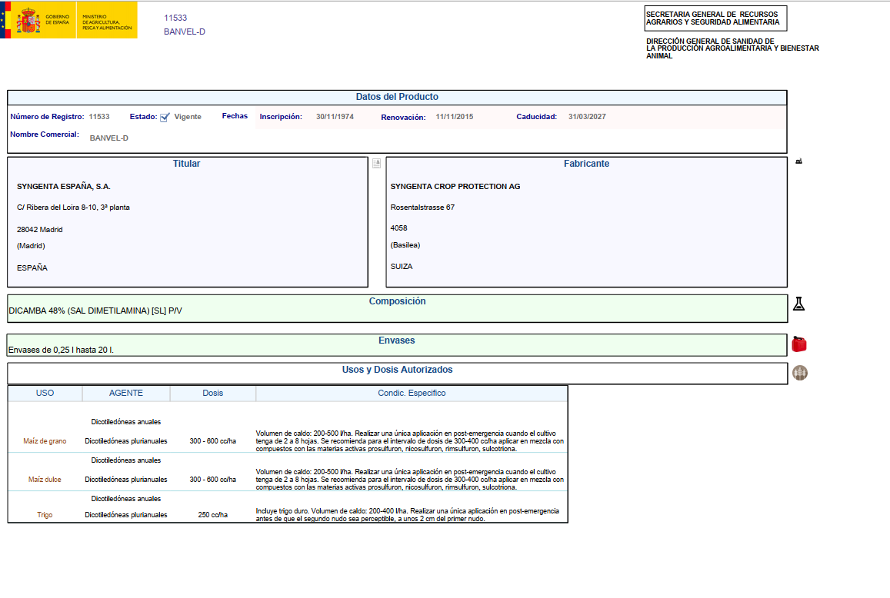
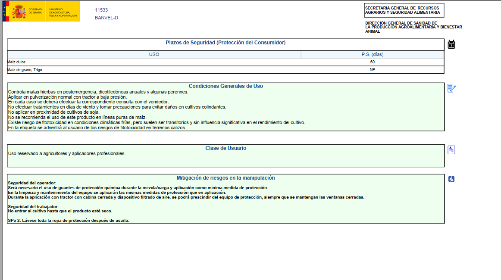
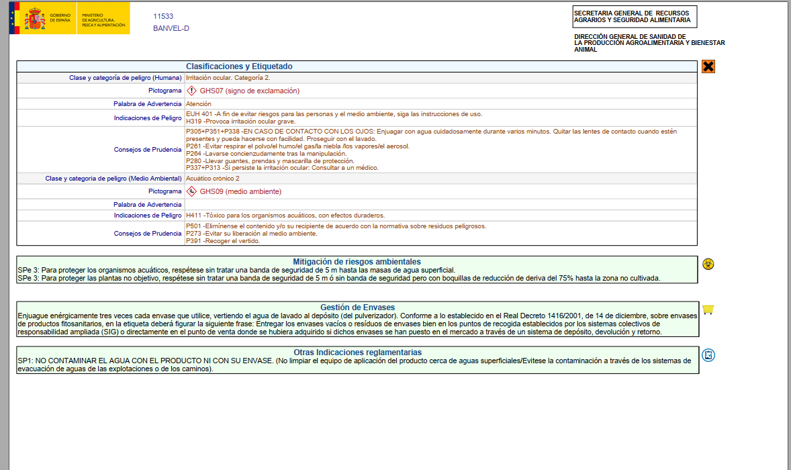
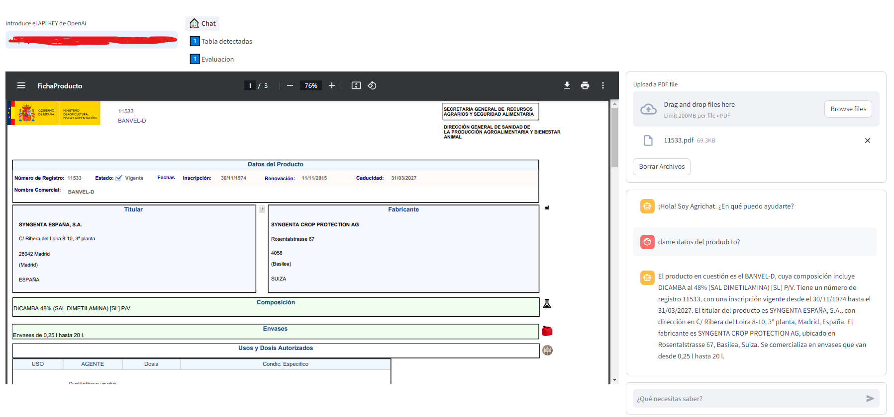
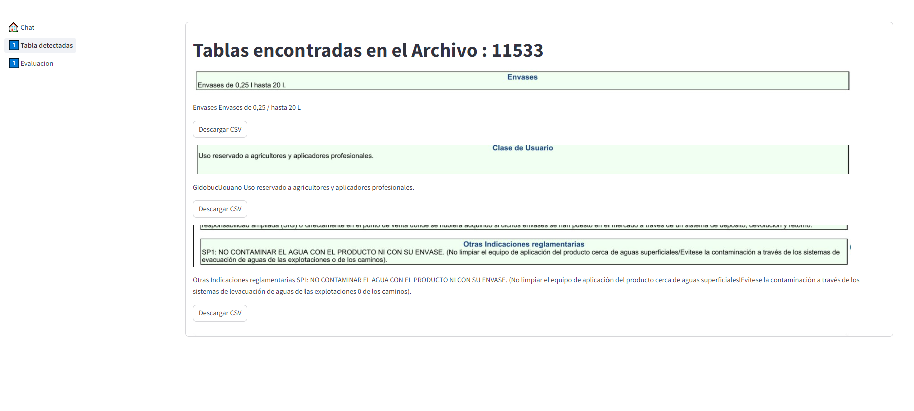

<!-- Improved compatibility of back to top link: See: https://github.com/othneildrew/Best-README-Template/pull/73 -->

<!--
*** Thanks for checking out the Best-README-Template. If you have a suggestion
*** that would make this better, please fork the repo and create a pull request
*** or simply open an issue with the tag "enhancement".
*** Don't forget to give the project a star!
*** Thanks again! Now go create something AMAZING! :D
-->

<!-- PROJECT SHIELDS -->
<!--
*** I'm using markdown "reference style" links for readability.
*** Reference links are enclosed in brackets [ ] instead of parentheses ( ).
*** See the bottom of this document for the declaration of the reference variables
*** for contributors-url, forks-url, etc. This is an optional, concise syntax you may use.
*** https://www.markdownguide.org/basic-syntax/#reference-style-links
-->

[![MIT License][license-shield]][license-url]
[![LinkedIn][linkedin-shield]][linkedin-url]

<!-- PROJECT LOGO -->
 

  

  <h3 align="center">AGRICHAT</h3>

<!-- TABLE OF CONTENTS -->

  
Indice

  <ol>
    <li>
      <a href="#Acerca de Agrichat">Acerca de Agrichat</a>
      <ul>
        <li><a href="#Construccion">Software</a></li>
      </ul>
    </li>
    <li>
      <a href="#Antes de empezar">Getting Started</a>
    </li>
    <li><a href="#Chat">Chat</a></li>
    <li><a href="#Extracción de datos no estructurados">Extracción de datos no estructurados</a></li>
    <li><a href="#Evaluacion">Evaluacion de RAG con RAGAS</a></li>
    <li><a href="#Contacto">Contact</a></li>
    
  </ol>

<!-- ABOUT THE PROJECT -->
## Acerca de Agrichat

AgriChat pertenece al TFM dentro del Máster en Ciencia de Datos de la UOC. Como tal, esta sujeto a errores de los cuales son responsables los usuarios que empleen agrichat.

Agrichat es un sistema conversacional basado en RAG junto con el poder del modelo Table Transformer para la identificacion de datos tabulares en archivos .pdf.

Su objetivo es poder extraer tablas de documentos pdf para transformarlas en informacion estructurada en formato .csv.

### Construccion

Para el desarrollo de AgriChat se ha usado:

* Streamlite
* LLamaIndex
* Table Transformer from Microsoft
* Pinecone
* RAGAS

(<a href="#arriba">ARRIBA</a>)

<!-- GETTING STARTED -->
## Antes de empezar

AgriChat funciona gracias a OPENIA, tanto para la construccion de embeddings como para el uso de LLMs.Es requisito tener un API_KEY.

Agrichat usa como base de conocimiento la base de datos vectorial. Se necesita una cuenta.

Dado que los modelos estan alojados en hugginghface:
* IDENTIFICADOR TABLAS: https://huggingface.co/kike/table-detection-fito
* IDENTIFICADOR ESTRUCTURA: https://huggingface.co/kike/table_structured_recognition_fito 

es necesarios descargarselos en local y construir la siguiente estructura de carpetas en la raiz del proyecto.

Agrichat se centra en la documentacion oficial del Ministerio de Agricultura y la informacion que produce en formato pdf sobre productos fitosanitarios. Asi pues los pdf que admite son los que disponen del siguiente formnato:

### Chat

Mediante esta pestaña podras chatear con Agrichat sobre los PDFs. Se trata de un sistema RAG que proporciona conocimiento desde los pdf.

(<a href="#readme-top">ARRIBA</a>)

<!-- USAGE EXAMPLES -->
## Tablas detectadas.

En esta seccion se puede observar las tablas que han podido ser extraido y descargar sus csv.

(<a href="#readme-top">ARRIBA</a>)

<!-- ROADMAP -->
## Evaluacion
Se dispone de un boton de evaluación que al ser presionado se lanza una evaluacion con el framework RAGAS para evaluar el comportamiento del RAG.

## Contacto

 Enrique Villalobos Torregrosa -> kike_mto@hotmail.com
 
 Trabajo Final de Máster -> https://github.com/loritobad/AgriChat/TFM/TFM-AgriChat.pdf

(<a href="#readme-top">ARRIBA</a>)

<!-- MARKDOWN LINKS & IMAGES -->
<!-- https://www.markdownguide.org/basic-syntax/#reference-style-links -->
[contributors-shield]: https://img.shields.io/github/contributors/othneildrew/Best-README-Template.svg?style=for-the-badge
[contributors-url]: https://github.com/othneildrew/Best-README-Template/graphs/contributors
[forks-shield]: https://img.shields.io/github/forks/othneildrew/Best-README-Template.svg?style=for-the-badge
[forks-url]: https://github.com/othneildrew/Best-README-Template/network/members
[stars-shield]: https://img.shields.io/github/stars/othneildrew/Best-README-Template.svg?style=for-the-badge
[stars-url]: https://github.com/othneildrew/Best-README-Template/stargazers
[issues-shield]: https://img.shields.io/github/issues/othneildrew/Best-README-Template.svg?style=for-the-badge
[issues-url]: https://github.com/othneildrew/Best-README-Template/issues
[license-shield]: https://img.shields.io/github/license/othneildrew/Best-README-Template.svg?style=for-the-badge
[license-url]: https://github.com/othneildrew/Best-README-Template/blob/master/LICENSE.txt
[linkedin-shield]: https://img.shields.io/badge/-LinkedIn-black.svg?style=for-the-badge&logo=linkedin&colorB=555
[linkedin-url]: https://www.linkedin.com/in/enrique-villalobos-torregrosa-32822624/
[product-screenshot]: images/screenshot.png
[Next.js]: https://img.shields.io/badge/next.js-000000?style=for-the-badge&logo=nextdotjs&logoColor=white
[Next-url]: https://nextjs.org/
[React.js]: https://img.shields.io/badge/React-20232A?style=for-the-badge&logo=react&logoColor=61DAFB
[React-url]: https://reactjs.org/
[Vue.js]: https://img.shields.io/badge/Vue.js-35495E?style=for-the-badge&logo=vuedotjs&logoColor=4FC08D
[Vue-url]: https://vuejs.org/
[Angular.io]: https://img.shields.io/badge/Angular-DD0031?style=for-the-badge&logo=angular&logoColor=white
[Angular-url]: https://angular.io/
[Svelte.dev]: https://img.shields.io/badge/Svelte-4A4A55?style=for-the-badge&logo=svelte&logoColor=FF3E00
[Svelte-url]: https://svelte.dev/
[Laravel.com]: https://img.shields.io/badge/Laravel-FF2D20?style=for-the-badge&logo=laravel&logoColor=white
[Laravel-url]: https://laravel.com
[Bootstrap.com]: https://img.shields.io/badge/Bootstrap-563D7C?style=for-the-badge&logo=bootstrap&logoColor=white
[Bootstrap-url]: https://getbootstrap.com
[JQuery.com]: https://img.shields.io/badge/jQuery-0769AD?style=for-the-badge&logo=jquery&logoColor=white
[JQuery-url]: https://jquery.com 
